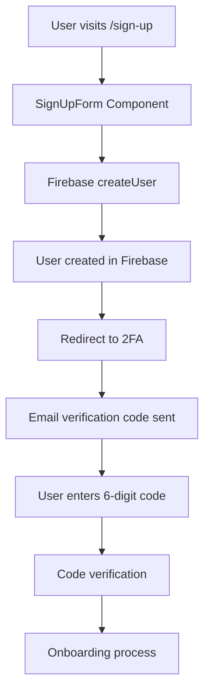
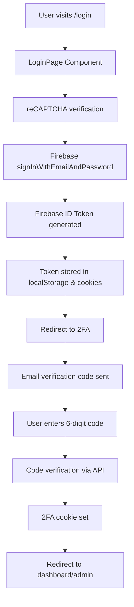

# Fluenccy Authentication System - Technical Documentation

## Overview

The Fluenccy application uses a comprehensive authentication system built on Firebase Authentication with additional security layers including Two-Factor Authentication (2FA) and role-based access control. This document provides a detailed technical overview of the authentication process from end-to-end.

## Architecture Overview

### Authentication Stack
- **Primary Provider**: Firebase Authentication
- **Token Management**: Firebase ID Tokens (JWT)
- **Two-Factor Authentication**: Custom email-based 2FA
- **Authorization**: Role-based access control (RBAC)
- **Session Management**: Local storage + cookies
- **Security**: reCAPTCHA integration

## Authentication Flow

### 1. User Registration Flow



**Key Components:**
- `src/client/domain/auth/pages/sign-up.page.tsx`
- `src/client/domain/auth/components/sign-up-form/sign-up-form.component.tsx`

### 2. User Login Flow



**Key Components:**
- `src/client/domain/auth/pages/login.page.tsx`
- `src/client/domain/auth/auth.service.ts`
- `src/client/domain/auth/auth.context.tsx`

### 3. Two-Factor Authentication (2FA)

The application implements a custom 2FA system using email verification codes:

**Flow:**
1. After successful Firebase authentication, user is redirected to 2FA page
2. System sends 6-digit verification code to user's email
3. User enters the code
4. Code is verified via `/api/auth/verify-code` endpoint
5. Upon successful verification, `two-factor-auth` cookie is set to `true`
6. User is redirected to appropriate dashboard

**Key Components:**
- `src/client/domain/auth/components/two-factor/token-form.component.tsx`
- `src/server/modules/authentication-code/authentication-code.controller.ts`

## Client-Side Authentication

### AuthContext Provider

The `AuthContext` provides centralized authentication state management:

```typescript
// src/client/domain/auth/auth.context.tsx
export type AuthContextType = {
  firebaseUser: firebase.User | null;
  isAuthenticated: boolean;
  isAuthenticating: boolean;
  login: (email: string, password: string) => Promise<void>;
  logout: () => Promise<void>;
  token: string | null;
  xeroSelected: boolean;
  setXeroSelected: (v: boolean) => void;
};
```

**Key Features:**
- Automatic token refresh handling
- Local storage and cookie management
- Analytics integration (Intercom, custom analytics)
- Apollo cache clearing on logout

### AuthService

The `AuthService` wraps Firebase authentication methods:

```typescript
// src/client/domain/auth/auth.service.ts
class AuthService {
  signInWithEmailAndPassword(email: string, password: string): Promise<firebase.User>
  sendResetPasswordEmail(email: string): Promise<void>
  signOut(): Promise<void>
  getToken(): Promise<string>
  onAuthStateChanged(callback: OnAuthStateChangedParam)
  onIdTokenChanged(callback: OnIsTokenChangedParam)
}
```

## Server-Side Authentication

### Firebase Admin SDK

The server uses Firebase Admin SDK for token verification:

```typescript
// src/server/domain/common/services/auth.service.ts
class AuthService {
  verifyToken(token: string): Promise<auth.DecodedIdToken>
  createUser({ displayName, email, password }: CreateUserParam): Promise<auth.UserRecord>
  getFirebaseUserByUid(firebaseUid: string): Promise<auth.UserRecord>
}
```

### Token Verification Process

1. **Client sends request** with `Authorization` header containing Firebase ID token
2. **Server extracts token** from request headers
3. **Token verification** using Firebase Admin SDK
4. **User lookup** in database using Firebase UID
5. **Permission checks** based on user role and organization access

```typescript
// src/server/modules/shared/base.controller.ts
async getSessionUser(req: any) {
  const firebaseToken = req.headers.authorization;
  const { uid } = await authService.verifyToken(firebaseToken);
  const user = await userDbGetters.getUserByFirebaseUid(uid);
  return user;
}
```

## Authorization & Role-Based Access Control

### User Roles

The system supports three distinct user roles:

```typescript
enum UserRole {
  accountowner  // Account owner with full access
  superuser     // Platform administrator
  superdealer   // Advanced trading capabilities
}
```

### Permission System

The `PermissionService` handles authorization logic:

```typescript
// src/server/domain/common/services/permission.service.ts
class PermissionService {
  async isSuperUser({ token }: IsSuperUserParam): Promise<boolean>
  async canAccessOrganisation({ token, orgId }: CanAccessByParam<'orgId'>): Promise<boolean>
  async canAccessTenant({ token, tenantId }: CanAccessByParam<'tenantId'>): Promise<boolean>
}
```

### Route Protection

#### AppRoute Component
Protects main application routes with comprehensive checks:

```typescript
// src/client/domain/app/components/app-route/app-route.component.tsx
export const AppRoute = memo((props: Props) => {
  // Authentication checks
  if (!isAuthenticated || !firebaseUser) {
    return history.push(AUTH_ROUTES.login);
  }
  
  // Two-factor authentication check
  if (getCookie('two-factor-auth') === 'false' || !getCookie('two-factor-auth')) {
    return history.push({pathname: AUTH_ROUTES.twoFactor, state: { email: firebaseUser?.email }});
  }
  
  // Role-based routing
  if (user.role === 'superuser') {
    return history.push(ADMIN_ROUTES.root);
  }
});
```

#### AdminRoute Component
Protects admin routes for superuser role only:

```typescript
// src/client/domain/admin/components/admin-route/admin-route.component.tsx
export const AdminRoute = memo((props: Props) => {
  if (user.role !== 'superuser') {
    setIsError(true);
    return;
  }
});
```

## API Endpoints

### Authentication Endpoints

| Endpoint | Method | Description | Authentication Required |
|----------|--------|-------------|----------------------|
| `/api/auth/send-code` | POST | Send 2FA verification code | Firebase token |
| `/api/auth/verify-code` | POST | Verify 2FA code | Firebase token |
| `/api/auth/resend-code` | POST | Resend 2FA code | Firebase token |

### GraphQL Context

The Apollo Server passes the authorization token to all resolvers:

```typescript
// src/server/app.server.ts
const apolloServer = new ApolloServer({
  context: ({ req }) => ({ token: req.headers.authorization }),
});
```

## Security Features

### 1. reCAPTCHA Integration
- Required for login attempts
- Prevents automated attacks
- Site key: `6LcA6L8fAAAAAMU6Odui6yqlKjO2kgBllnl9dxSu`

### 2. Two-Factor Authentication
- Email-based verification codes
- 6-digit numeric codes
- Time-limited validity
- Rate limiting on resend attempts

### 3. Token Management
- Firebase ID tokens with automatic refresh
- Secure storage in localStorage and cookies
- Token validation on every API request

### 4. Session Security
- Automatic logout on token expiration
- Clear sensitive data on logout
- Cross-tab session synchronization

## Error Handling

### Authentication Errors

```typescript
// Common Firebase authentication errors
const FIREBASE_AUTH_ERROR = {
  userNotFound: 'auth/user-not-found',
  wrongPassword: 'auth/wrong-password',
  invalidEmail: 'auth/invalid-email',
  userDisabled: 'auth/user-disabled',
  tooManyRequests: 'auth/too-many-requests'
};
```

### Error Responses

- **401 Unauthorized**: Invalid or missing token
- **403 Forbidden**: Insufficient permissions
- **400 Bad Request**: Invalid request data

## Configuration

### Environment Variables

```bash
# Firebase Admin SDK
FIREBASE_ADMIN_CLIENT_EMAIL=your-service-account-email
FIREBASE_ADMIN_CLIENT_ID=your-client-id
FIREBASE_ADMIN_CLIENT_X509_CERT_URL=your-cert-url
FIREBASE_ADMIN_PRIVATE_KEY_ID=your-private-key-id
FIREBASE_ADMIN_PRIVATE_KEY=your-private-key
FIREBASE_PROJECT_ID=your-project-id

# reCAPTCHA
RECAPTCHA_API_KEY=your-recaptcha-site-key
```

### Firebase Configuration

The client-side Firebase configuration is handled through the `firebaseService` in the common module.

## Data Flow

### 1. Login Process
```
User Input → reCAPTCHA → Firebase Auth → Token Generation → 2FA → Dashboard
```

### 2. API Request Process
```
Client Request → Token Extraction → Firebase Verification → User Lookup → Permission Check → Response
```

### 3. Logout Process
```
Logout Trigger → Firebase SignOut → Clear Tokens → Clear Cache → Redirect to Login
```

## Best Practices

### 1. Token Security
- Always use HTTPS in production
- Implement token refresh logic
- Clear tokens on logout
- Validate tokens on every request

### 2. Error Handling
- Provide user-friendly error messages
- Log security events
- Implement rate limiting
- Handle network failures gracefully

### 3. User Experience
- Show loading states during authentication
- Provide clear error messages
- Implement remember me functionality
- Handle session timeouts gracefully

## Troubleshooting

### Common Issues

1. **Token Expiration**
   - Symptoms: 401 errors, automatic redirects to login
   - Solution: Implement token refresh logic

2. **2FA Code Issues**
   - Symptoms: Code not accepted, email not received
   - Solution: Check email delivery, verify code format

3. **Permission Denied**
   - Symptoms: 403 errors, access denied messages
   - Solution: Verify user role and organization access

4. **Firebase Connection Issues**
   - Symptoms: Authentication failures, network errors
   - Solution: Check Firebase configuration and network connectivity

### Debug Tools

- Browser DevTools: Check localStorage and cookies
- Network tab: Monitor API requests and responses
- Console logs: Check for authentication errors
- Firebase Console: Monitor authentication events

## Security Considerations

1. **Token Storage**: Tokens are stored in both localStorage and cookies for redundancy
2. **HTTPS Only**: All authentication should occur over HTTPS
3. **Token Expiration**: Implement proper token refresh mechanisms
4. **Rate Limiting**: Implement rate limiting on authentication endpoints
5. **Audit Logging**: Log all authentication events for security monitoring

## Future Enhancements

1. **OAuth Integration**: Support for Google, Microsoft, etc.
2. **Biometric Authentication**: Fingerprint, face recognition
3. **Hardware Security Keys**: FIDO2/WebAuthn support
4. **Advanced 2FA**: TOTP, SMS-based verification
5. **Session Management**: Advanced session controls and monitoring

## Practical Examples

### 1. Implementing a Protected Component

```typescript
import React from 'react';
import { useAuth } from '@client/auth';

const ProtectedComponent = () => {
  const { isAuthenticated, isAuthenticating, user } = useAuth();
  
  if (isAuthenticating) {
    return <div>Loading...</div>;
  }
  
  if (!isAuthenticated) {
    return <div>Please log in to access this content.</div>;
  }
  
  return (
    <div>
      <h1>Welcome, {user?.displayName}!</h1>
      <p>This content is only visible to authenticated users.</p>
    </div>
  );
};
```

### 2. Role-Based Component Rendering

```typescript
import React from 'react';
import { useAuth } from '@client/auth';
import { useQueryLocalUser } from '@client/user';

const RoleBasedComponent = () => {
  const { isAuthenticated } = useAuth();
  const { user } = useQueryLocalUser();
  
  if (!isAuthenticated) {
    return <div>Access denied</div>;
  }
  
  return (
    <div>
      {user.role === 'superuser' && (
        <AdminPanel />
      )}
      {user.role === 'accountowner' && (
        <AccountDashboard />
      )}
      {user.role === 'superdealer' && (
        <TradingInterface />
      )}
    </div>
  );
};
```

### 3. Custom Authentication Hook

```typescript
import { useAuth } from '@client/auth';
import { useQueryLocalUser } from '@client/user';

export const usePermissions = () => {
  const { isAuthenticated } = useAuth();
  const { user } = useQueryLocalUser();
  
  const canAccessAdmin = () => {
    return isAuthenticated && user?.role === 'superuser';
  };
  
  const canAccessTrading = () => {
    return isAuthenticated && ['superdealer', 'accountowner'].includes(user?.role);
  };
  
  const canManageOrganizations = () => {
    return isAuthenticated && user?.role !== 'superdealer';
  };
  
  return {
    canAccessAdmin,
    canAccessTrading,
    canManageOrganizations,
    userRole: user?.role,
    isAuthenticated
  };
};
```

### 4. Server-Side Permission Check

```typescript
// In a GraphQL resolver
const someResolver = async (parent, args, { token }) => {
  // Check if user is authenticated
  const user = await userResource.getUserByToken(token);
  
  // Check specific permissions
  if (user.role !== 'superuser') {
    throw new ForbiddenError('Insufficient permissions');
  }
  
  // Proceed with the operation
  return await performAdminOperation();
};
```

### 5. API Request with Authentication

```typescript
import axios from 'axios';
import { localStorageService } from '@client/common';

const makeAuthenticatedRequest = async (endpoint: string, data: any) => {
  const token = localStorageService.getItem('firebase-token');
  
  try {
    const response = await axios.post(endpoint, data, {
      headers: {
        'Authorization': token,
        'Content-Type': 'application/json'
      }
    });
    
    return response.data;
  } catch (error) {
    if (error.response?.status === 401) {
      // Token expired or invalid, redirect to login
      window.location.href = '/login';
    }
    throw error;
  }
};
```

### 6. Two-Factor Authentication Implementation

```typescript
// Client-side 2FA verification
const verifyTwoFactorCode = async (code: string, email: string) => {
  const token = localStorageService.getItem('firebase-token');
  
  try {
    const response = await axios.post('/api/auth/verify-code', {
      code,
      email
    }, {
      headers: {
        'Authorization': token
      }
    });
    
    if (response.data.success) {
      // Set 2FA cookie
      setCookie('two-factor-auth', 'true');
      return true;
    }
  } catch (error) {
    console.error('2FA verification failed:', error);
    return false;
  }
};
```

### 7. Logout Implementation

```typescript
import { useAuth } from '@client/auth';
import { clearLocalApolloCache } from '@client/common';

const LogoutButton = () => {
  const { logout } = useAuth();
  
  const handleLogout = async () => {
    try {
      await logout();
      // Additional cleanup if needed
      clearLocalApolloCache();
      // Redirect to login page
      window.location.href = '/login';
    } catch (error) {
      console.error('Logout failed:', error);
    }
  };
  
  return (
    <button onClick={handleLogout}>
      Logout
    </button>
  );
};
```

### 8. Authentication State Monitoring

```typescript
import { useEffect } from 'react';
import { useAuth } from '@client/auth';

const AuthMonitor = () => {
  const { isAuthenticated, isAuthenticating, token } = useAuth();
  
  useEffect(() => {
    // Monitor authentication state changes
    if (!isAuthenticating) {
      if (isAuthenticated) {
        console.log('User is authenticated');
        // Perform authenticated user actions
      } else {
        console.log('User is not authenticated');
        // Redirect to login or show login prompt
      }
    }
  }, [isAuthenticated, isAuthenticating]);
  
  useEffect(() => {
    // Monitor token changes
    if (token) {
      console.log('Token updated:', token.substring(0, 20) + '...');
    }
  }, [token]);
  
  return null; // This is a monitoring component
};
```

### 9. Error Handling for Authentication

```typescript
import { useAuth } from '@client/auth';
import { useToast } from '@client/common';

const LoginForm = () => {
  const { login } = useAuth();
  const { addToast } = useToast();
  const [error, setError] = useState('');
  
  const handleLogin = async (email: string, password: string) => {
    try {
      await login(email, password);
      addToast('Login successful!', 'success');
    } catch (error) {
      let errorMessage = 'Login failed. Please try again.';
      
      switch (error.code) {
        case 'auth/user-not-found':
        case 'auth/wrong-password':
          errorMessage = 'Invalid email or password.';
          break;
        case 'auth/too-many-requests':
          errorMessage = 'Too many failed attempts. Please try again later.';
          break;
        case 'auth/user-disabled':
          errorMessage = 'This account has been disabled.';
          break;
      }
      
      setError(errorMessage);
      addToast(errorMessage, 'danger');
    }
  };
  
  return (
    <form onSubmit={handleSubmit}>
      {/* Form fields */}
      {error && <div className="error">{error}</div>}
    </form>
  );
};
```

### 10. Testing Authentication

```typescript
// Jest test example
import { render, screen, fireEvent, waitFor } from '@testing-library/react';
import { AuthProvider } from '@client/auth';
import { LoginPage } from '@client/auth/pages/login.page';

const renderWithAuth = (component: React.ReactElement) => {
  return render(
    <AuthProvider>
      {component}
    </AuthProvider>
  );
};

describe('Authentication', () => {
  test('should show login form', () => {
    renderWithAuth(<LoginPage />);
    expect(screen.getByTestId('flnc-email-input')).toBeInTheDocument();
    expect(screen.getByTestId('flnc-password-input')).toBeInTheDocument();
  });
  
  test('should handle login submission', async () => {
    renderWithAuth(<LoginPage />);
    
    fireEvent.change(screen.getByTestId('flnc-email-input'), {
      target: { value: 'test@example.com' }
    });
    fireEvent.change(screen.getByTestId('flnc-password-input'), {
      target: { value: 'password123' }
    });
    
    fireEvent.click(screen.getByTestId('flnc-submit-button'));
    
    await waitFor(() => {
      // Assert login behavior
    });
  });
});
```

## Common Patterns

### 1. Route Protection Pattern
```typescript
const ProtectedRoute = ({ component: Component, ...rest }) => {
  const { isAuthenticated, isAuthenticating } = useAuth();
  
  if (isAuthenticating) return <LoadingSpinner />;
  if (!isAuthenticated) return <Redirect to="/login" />;
  
  return <Component {...rest} />;
};
```

### 2. Permission-Based Rendering Pattern
```typescript
const ConditionalRender = ({ permission, children, fallback = null }) => {
  const { user } = useQueryLocalUser();
  
  if (checkPermission(user, permission)) {
    return children;
  }
  
  return fallback;
};
```

### 3. Authentication Guard Pattern
```typescript
const withAuth = (WrappedComponent) => {
  return (props) => {
    const { isAuthenticated, isAuthenticating } = useAuth();
    
    if (isAuthenticating) return <LoadingSpinner />;
    if (!isAuthenticated) return <LoginPrompt />;
    
    return <WrappedComponent {...props} />;
  };
};
```

---

This documentation provides a comprehensive overview of the Fluenccy authentication system. For specific implementation details, refer to the source code files mentioned throughout this document.
